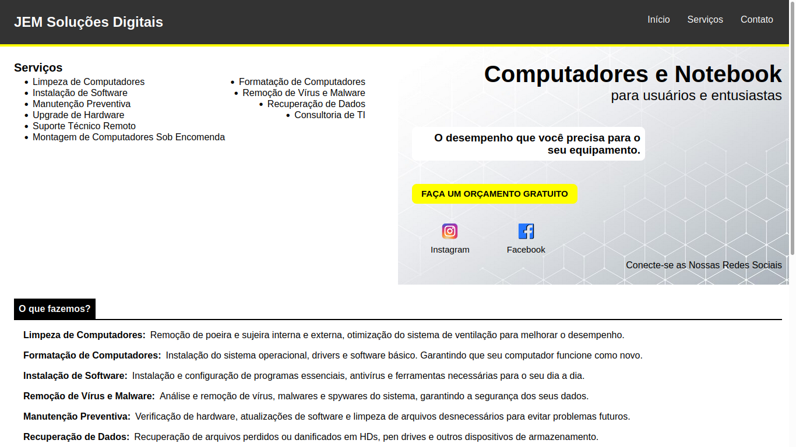

# JEM Soluções Digitais

## Descrição
O projeto JEM Soluções Digitais é uma aplicação web desenvolvida para uma assistência técnica, dedicada a fornecer serviços de manutenção e suporte para computadores e dispositivos tecnológicos. A aplicação é intuitiva e apresenta informações sobre serviços, orçamentos e formas de contato, facilitando a interação dos clientes com a empresa.

## Funcionalidades
- Início: Apresenta uma visão geral dos serviços oferecidos pela assistência técnica.
- Serviços: Lista detalhada dos serviços disponíveis

## Tecnologias Utilizadas
- React.js
- CSS
- HTML
- JSX
- React Icons
- UseState

## Instalação
Para rodar este projeto localmente, siga os passos abaixo:

1. Clone o repositório:
   git clone https://github.com/seu-usuario/jem-solutions.git
   
2. Navegue até o diretório do projeto:
   cd jem-solutions
     
3. Instale as dependências:
   npm install
   
4. Inicie o servidor de desenvolvimento:
   npm start

5. Abra seu navegador e acesse `http://localhost:8080`.

## Contribuição
Contribuições são bem-vindas! Se você deseja contribuir com este projeto, siga as etapas abaixo:

1. Faça um fork do repositório.
2. Crie uma branch para sua feature (`git checkout -b minha-feature`).
3. Faça suas alterações e adicione commits (`git commit -m 'Adicionei uma nova feature'`).
4. Envie para o repositório remoto (`git push origin minha-feature`).
5. Abra um Pull Request.

## Licença
Este projeto está licenciado sob a Licença MIT - veja o arquivo LICENSE para mais detalhes.

## Contato
Para dúvidas ou sugestões, entre em contato:

- Nome: Jonatas Elieser Moreira
- Email: jonatas.em20@gmail.com
- LinkedIn: [Jonatas](https://www.linkedin.com/in/jonatas-elieser-moreira-948632270/)
